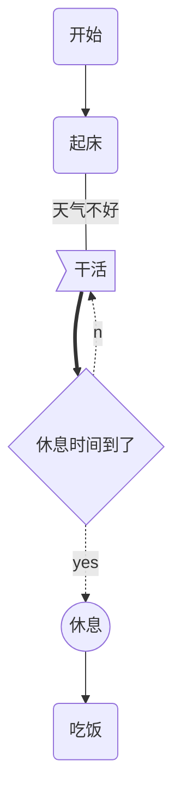
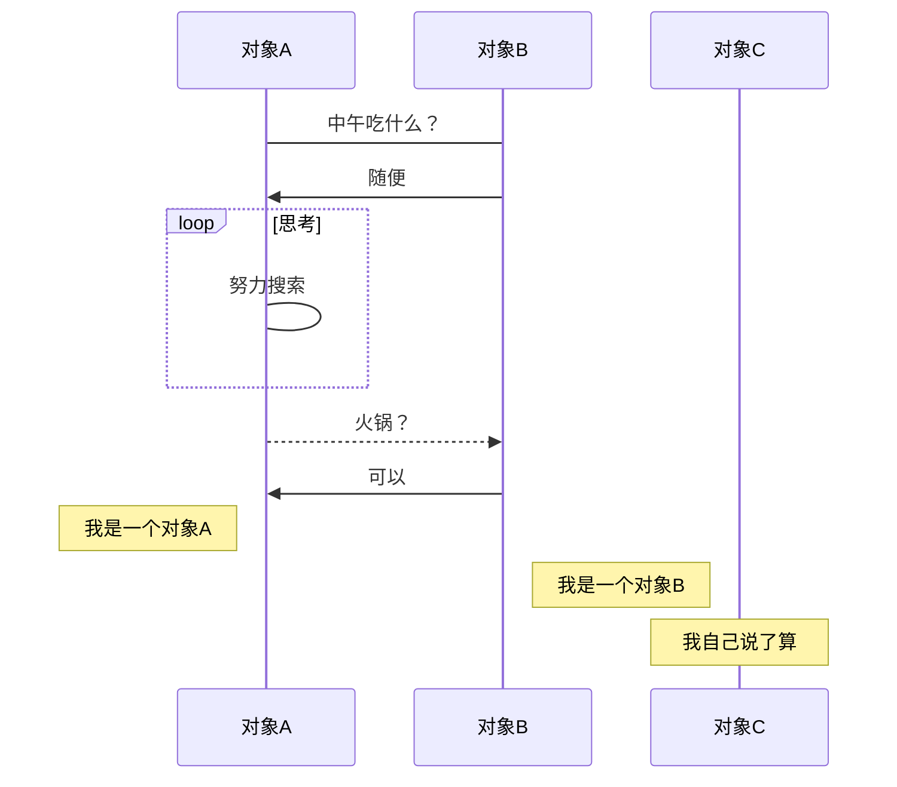
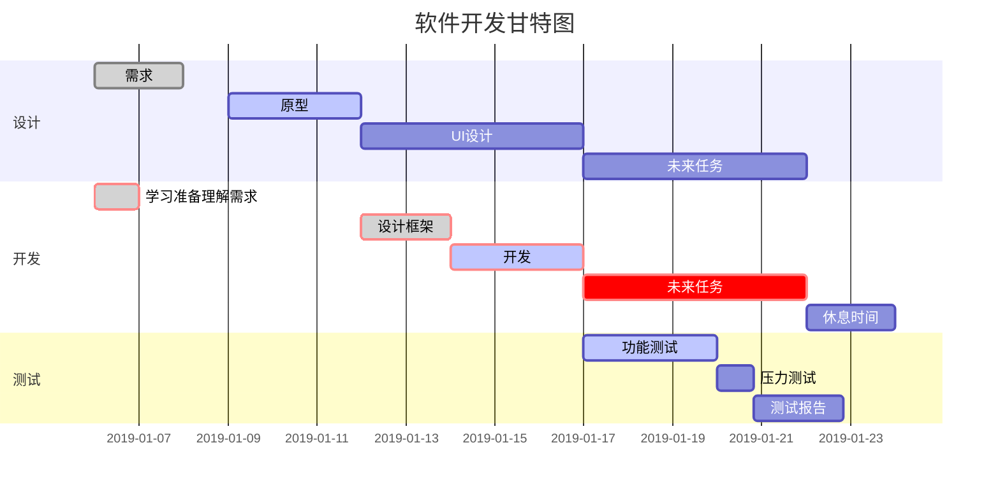

# MailList
MailList邮件列表

## Maillist邮件列表
- 支持订阅
- 支持邮件转发

## MarkDown表格

|   id   |   name   |
| :--: | :--: |
| 001  | luxu |

## 流程图

```mermaid
graph TD
    A(开始) -->B(起床)
    B --天气不好--- C>干活]
    C ==> D{休息时间到了}
    D -.yes.-> E((休息))
    D -.no.-> C
    E --> F(吃饭)
```

## 时序图

```mermaid
sequenceDiagram
对象A->对象B:中午吃什么？
对象B->>对象A: 随便
loop 思考
    对象A->对象A: 努力搜索
end
对象A-->>对象B: 火锅？
对象B->>对象A: 可以
Note left of 对象A: 我是一个对象A
Note right of 对象B: 我是一个对象B
participant 对象C
Note over 对象C: 我自己说了算
```

## 甘特图

```mermaid
gantt
        dateFormat  YYYY-MM-DD

        title 软件开发甘特图

        section 设计
        需求:done,des1, 2019-01-06,2019-01-08
        原型:active,des2, 2019-01-09, 3d
        UI设计:des3, after des2, 5d
        未来任务:des4, after des3, 5d

        section 开发
        学习准备理解需求:crit, done, 2019-01-06,24h
        设计框架:crit, done, after des2, 2d
        开发:crit, active, 3d
        未来任务:crit, 5d
        休息时间:2d

        section 测试
        功能测试:active, a1, after des3, 3d
        压力测试:after a1, 20h
        测试报告: 48h
```

